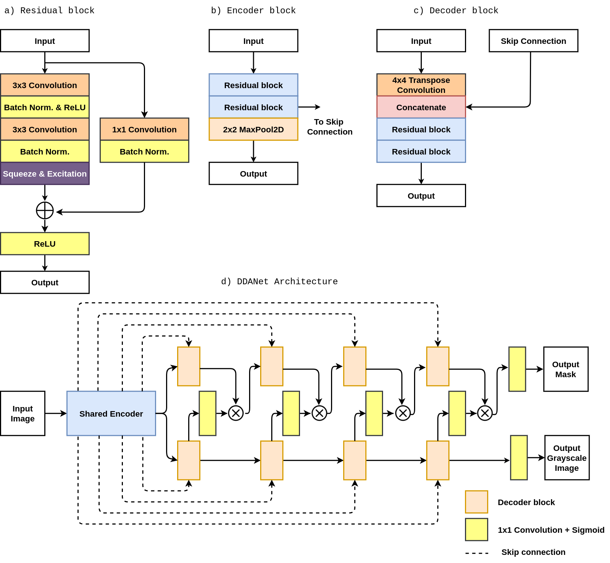
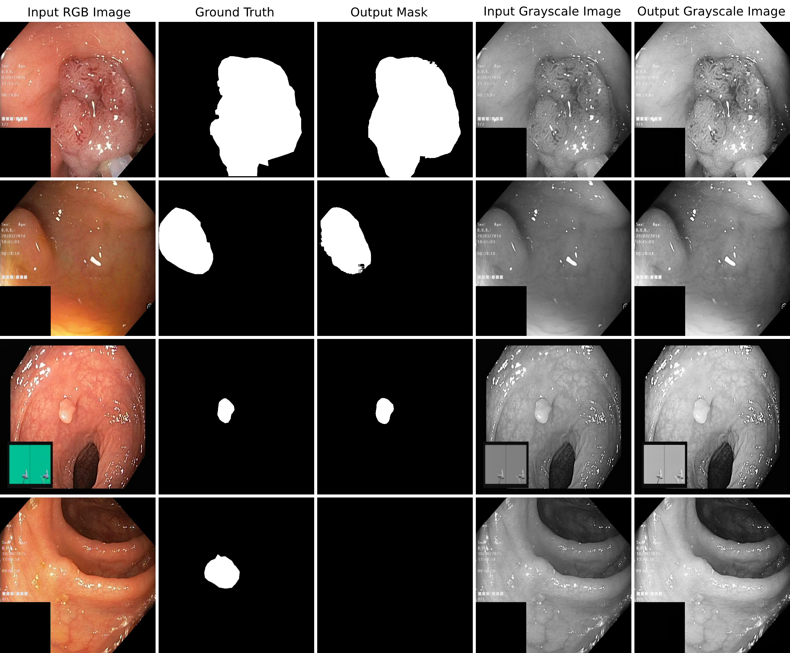

# DDANet: Dual Decoder Attention Network for Automatic Polyp Segmentation

Authors: [Nikhil Kumar Tomar](https://www.linkedin.com/in/nktomar/), [Debesh Jha](https://www.linkedin.com/in/debesh-jha-071462aa/), Sharib Ali, Håvard D. Johansen, Dag Johansen, Michael A. Riegler and Pål Halvorsen

## Architecture
The proposed DDANet isfully convolutional network consists of a single encoder and dual decoders. Theencoder  consists  of  4  encoder  block  whereas  each  decoder  also  consists  of  4 decoder block. The encoder takes the RGB image as input which passes throughthe shared encoder and then it goes through both the decoders. The first decodergives  the  segmentation  mask  and  the  second  decoder  gives  the  original  inputimage in the grayscale format

## Quantative Results
| Dataset | DSC |  Mean IOU| Recall | Precision |
| :---: | :---: | :---: | :---: | :---: |
| Kvasir Test set | 0.8576 | 0.7800 | 0.8880 | 0.8643 |
| Organiser's Test set | 0.7010 | 0.7874 | 0.7987 | 0.8577 |

## Qualitative Results

